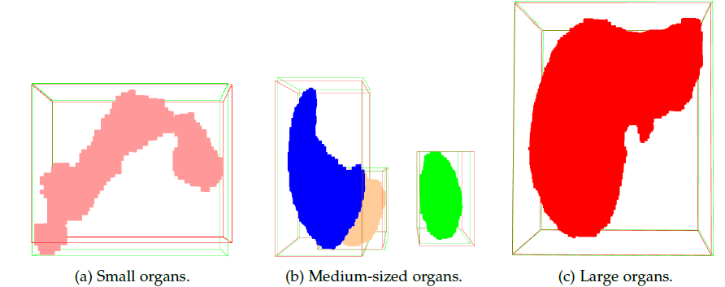
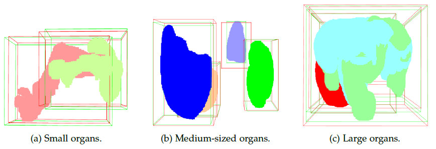
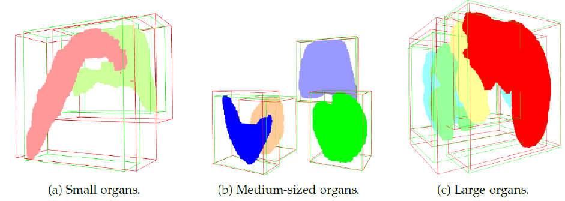
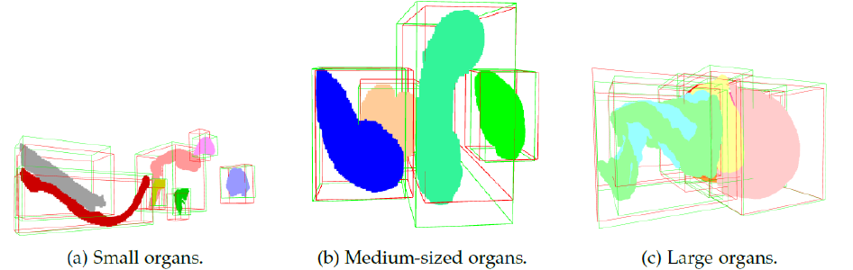

# Organ-DETR

Organ-DETR is a DEtection TRansformer (DETR) model enhanced with two novel modules: MultiScale Attention (MSA) and Dense Query Matching (DQM) for improving the performance of 3D organ detection. This project also explores Continual Learning (CL) techniques to adapt the model to new datasets while retaining knowledge from previous training sessions.

## Introduction

Medical image analysis is a dynamic field, constantly evolving with new datasets and domains. Adapting neural networks to these new data distributions represents a significant challenge for deep learning, as models tend to optimize only for current data and struggle to retain knowledge from previous training sessions. To address this problem, Continual Learning (CL) has emerged as a promising approach for updating models to new domains while preserving past knowledge and avoiding catastrophic forgetting.

The aim of this work is to extend a transformer-based 3D organ recognition neural network, called Organ-DEtection TRansformer (DETR), to CL tasks. Two experiments of class-incremental learning for the organ detection task will be conducted, each involving two medical datasets. In addition, two CL techniques have been developed to evaluate which method yields a more adaptive model. 


## Architecture

<p align="center">
  
</p>

The Organ-DETR architecture consists of essential components: an initial stage with a feature extractor backbone that generates feature maps, followed by a MultiScale Attention (MSA) module that enriches semantic features through self- and cross-attention mechanisms. These enriched features, together with a segmentation head, support the generation of multiple segmentation maps for improved object detection. The decoder includes a classification head, a regression head and later a Dense Query Matching (DQM) mechanism, which is crucial for effective model training and performance as it duplicates the ground truth labels

## Continual Learning Techniques

### Auxiliary Network Continual Learning (ANCL)

<p align="center">
  
</p>

**Auxiliary Network Continual Learning (ANCL)**: Incorporates predictions from the old model (optimized on the previous task) and the auxiliary network (optimized on the current task) into the loss function of the main network. 

### Replay-Based Approach
<p align="center">
  
</p>

**Replay-Based Approach**: Mitigates forgetting by including the most challenging samples from previous tasks in the current task data loader.


## Installation

To set up the environment and install the necessary dependencies, follow these steps:

1. Create a conda environment:
   ```bash
   conda create -n organ_detr python=3.9.15 anaconda
   conda activate organ_detr
   ```
2. Create a conda environment:
   ```bash
    conda install pytorch==1.11.0 torchvision==0.12.0 torchaudio==0.11.0 -c pytorch
   ```
3. Install additional Python packages:
   ```bash
    pip install -r requirements.txt
    pip install opencv-python
    pip3 install open3d   
    ```

## Running the model
Before running the training script, set the dataset path environment variable:

- On Windows:
   ```bash
    SET TRANSOAR_DATA=your_dataset_path
    ```
- On Linux:
   ```bash
    export TRANSOAR_DATA=your_dataset_path
    ```

To start training, use the following command:
```bash
   python ./scripts/train.py --config {config file of technique}
```

# Results

According to the results of Experiment 1 (AbdomenCT-1K and WORD datasets), the best ANCL model (training session 5) achieved an Average Incremental Accuracy (AIA) of 0.412 and a Forgetting Measure (FM) of 0.544, while the best replay-based CL model (with 50 replay samples) achieved an AIA of 0.703 and a FM of 0.041. 

In Experiment 2 (WORD and TotalSegmentator datasets), the best ANCL model (training session 4) achieved an AIA of 0.263 and a FM of 0.362, while the best replay-based CL model (with 50 replay samples) achieved an AIA of 0.464 and a FM of 0.001. Therefore, it has been demonstrated that the replay-based approach is the most effective CL method for these organ detection tasks, though considerations regarding privacy concerns and the computational and temporal resources required must be considered.

### Results for Replay-Based Approach on AbdomenCT-1K Dataset (Experiment 1)

<p align="center">
  
</p>
Experiment 1: 3D predictions (red) and ground truth (green) of case 17 from the test set of the AbdomenCT-1K dataset using the best model (50 replay samples) from the replay-based CL approach

### Results for Replay-Based Approach on WORD Dataset (Experiment 1)
<p align="center">
  
</p>
Experiment 1: 3D predictions (red) and ground truth (green) of case 27 from the test set of the WORD dataset using the best model (50 replay samples) from the replay-based CL approach.

### Results for Replay-Based Approach on WORD Dataset (Experiment 2)
<p align="center">
  
</p>
Experiment 2: 3D predictions (red) and ground truth (green) of case 7 from the test set of the WORD dataset using the best model (50 replay samples) from the replay-based CL approach.

### Results for Replay-Based Approach on TotalSegmentator Dataset (Experiment 2)
<p align="center">
  
</p>
Experiment 2: 3D predictions (red) and ground truth (green) of case 25 from the test set of the TotalSegmentator dataset using the best model (50 replay samples) from the replay-based CL approach.

# Conclusion
While the replay-based approach demonstrated the most effectiveness in preventing catastrophic forgetting, it is important to consider the privacy concerns, computational resources, and time required for this method.

# References

[1] Benjamin Raphael Ernhofer. Organ Detection in Computed Tomography. 2023. url: https://ai-med.de/wp-content/uploads/2023/12/MasterThesis_OrganDet_Ernhofer.pdf

[2] Morteza Ghahremani, Benjamin Raphael Ernhofer, JiajunWang, and ChristianWachinger. Organ-DETR: 3D Organ Detection Transfomer with Multiscale Attention and Dense Query Matching. 2024. url: https://openreview.net/forum?id=7YEXo5qUmN

[3] Sanghwan Kim, Lorenzo Noci, Antonio Orvieto, and Thomas Hofmann, “Achieving a Better Stability-Plasticity Trade-off via Auxiliary Networks in Continual Learning,” in 2023 IEEE/CVF Conference on Computer Vision and Pattern Recognition (CVPR), Jun. 2023, pp. 1-10, doi: https://doi.org/10.1109/CVPR52729.2023.01148

[4] Pratibha Kumari, Joohi Chauhan, Afshin Bozorgpour, Boqiang Huang, Reza Azad, and Dorit Merhof. “Continual Learning in Medical Image Analysis: A Comprehensive Review of Recent
Advancements and Future Prospects”. In: (Dec. 2023). url: https://arxiv.org/abs/2312.17004v2

[5] Jun Ma, Yao Zhang, Song Gu, Cheng Zhu, Cheng Ge, Yichi Zhang, Xingle An, Congcong Wang, Qiyuan Wang, Xin Liu, Shucheng Cao, Qi Zhang, Shangqing Liu, Yunpeng Wang, Yuhui Li, Jian He, and Xiaoping Yang. “AbdomenCT-1K: Is Abdominal Organ Segmentation a Solved Problem?” In: IEEE transactions on pattern analysis and machine intelligence 44 (10 2022). issn: 1939-3539. doi: 10.1109/TPAMI.2021.3100536. url: https://pubmed.ncbi.nlm.nih.gov/34314356/.

[6] Xiangde Luo, Wenjun Liao, Jianghong Xiao, Jieneng Chen, Tao Song, Xiaofan Zhang, Kang Li, Dimitris N. Metaxas, GuotaiWang, and Shaoting Zhang. “WORD: A large scale dataset, benchmark and clinical applicable study for abdominal organ segmentation from CT image”. In: Medical Image Analysis 82 (Nov. 2021). doi: 10.1016/j.media.2022. 102642. url: http://arxiv.org/abs/2111.02403%20http://dx.doi.org/10.1016/j. media.2022.102642.

[7] Jakob Wasserthal, Hanns-Christian Breit, Manfred T Meyer, Maurice Pradella, Daniel Hinck, Alexander W Sauter, Tobias Heye, Daniel Boll, Joshy Cyriac Msc, Shan Yang, Michael Bach, and Martin Segeroth. “TotalSegmentator: Robust Segmentation of 104 Anatomical Structures in CT images”. In: (2023). doi: 10.5281/zenodo.6802613. url: https://www.github.com/wasserth/TotalSegmentator.


