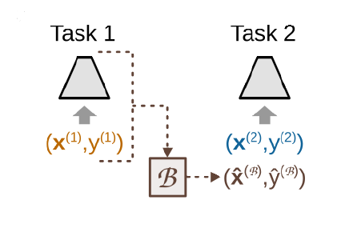

# Organ-DETR

Organ-DETR is a DEtection TRansformer (DETR) model enhanced with two novel modules: MultiScale Attention (MSA) and Dense Query Matching (DQM) for improving the performance of 3D organ detection. This project also explores Continual Learning (CL) techniques to adapt the model to new datasets while retaining knowledge from previous training sessions.

## Introduction

Medical image analysis is a dynamic field, constantly evolving with new datasets and domains. Adapting neural networks to these new data distributions represents a significant challenge for deep learning, as models tend to optimize only for current data and struggle to retain knowledge from previous training sessions. To address this problem, Continual Learning (CL) has emerged as a promising approach for updating models to new domains while preserving past knowledge and avoiding catastrophic forgetting.

The aim of this work is to extend a transformer-based 3D organ recognition neural network, called Organ-DEtection TRansformer (DETR), to CL tasks. Two experiments of class-incremental learning for the organ detection task will be conducted, each involving two medical datasets. In addition, two CL techniques have been developed to evaluate which method yields a more adaptive model. 


## Architecture


The Organ-DETR architecture consists of essential components: an initial stage with a feature extractor backbone that generates feature maps, followed by a MultiScale Attention (MSA) module that enriches semantic features through self- and cross-attention mechanisms. These enriched features, together with a segmentation head, support the generation of multiple segmentation maps for improved object detection. The decoder includes a classification head, a regression head and later a Dense Query Matching (DQM) mechanism, which is crucial for effective model training and performance as it duplicates the ground truth labels

## Continual Learning Techniques

### Auxiliary Network Continual Learning (ANCL)


**Auxiliary Network Continual Learning (ANCL)**: Incorporates predictions from the old model (optimized on the previous task) and the auxiliary network (optimized on the current task) into the loss function of the main network. 

### Replay-Based Approach



**Replay-Based Approach**: Mitigates forgetting by including the most challenging samples from previous tasks in the current task data loader.


## Installation

To set up the environment and install the necessary dependencies, follow these steps:

1. Create a conda environment:
   ```bash
   conda create -n organ_detr python=3.9.15 anaconda
   conda activate organ_detr
   ```
2. Create a conda environment:
   ```bash
    conda install pytorch==1.11.0 torchvision==0.12.0 torchaudio==0.11.0 -c pytorch
   ```
3. Install additional Python packages:
   ```bash
    pip install -r requirements.txt
    pip install opencv-python
    pip3 install open3d   
    ```

## Running the model
Before running the training script, set the dataset path environment variable:

- On Windows:
   ```bash
    SET TRANSOAR_DATA=your_dataset_path
    ```
- On Linux:
   ```bash
    export TRANSOAR_DATA=your_dataset_path
    ```

To start training, use the following command:

   ```bash
    python ./scripts/train.py --config {config file of technique}
    ```

# Results

According to the results of Experiment 1, the best ANCL model (training session 5) achieved an Average Incremental Accuracy (AIA) of 0.412 and a Forgetting Measure (FM) of 0.544, while the best replay-based CL model (with 50 replay samples) achieved an AIA of 0.703 and a FM of 0.041. 

In Experiment 2, the best ANCL model (training session 4) achieved an AIA of 0.263 and a FM of 0.362, while the best replay-based CL model (with 50 replay samples) achieved an AIA of 0.464 and a FM of 0.001. Therefore, it has been demonstrated that the replay-based approach is the most effective CL method for these organ detection tasks, though considerations regarding privacy concerns and the computational and temporal resources required must be considered.

# Conclusion
While the replay-based approach demonstrated the most effectiveness in preventing catastrophic forgetting, it is important to consider the privacy concerns, computational resources, and time required for this method.


